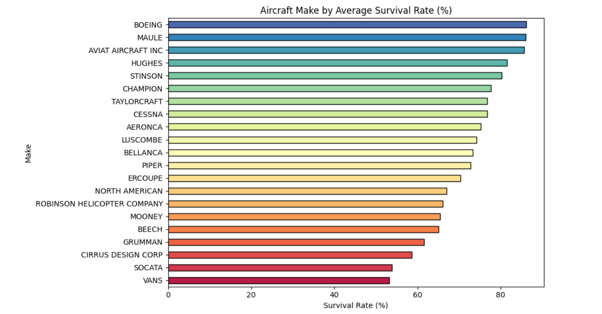
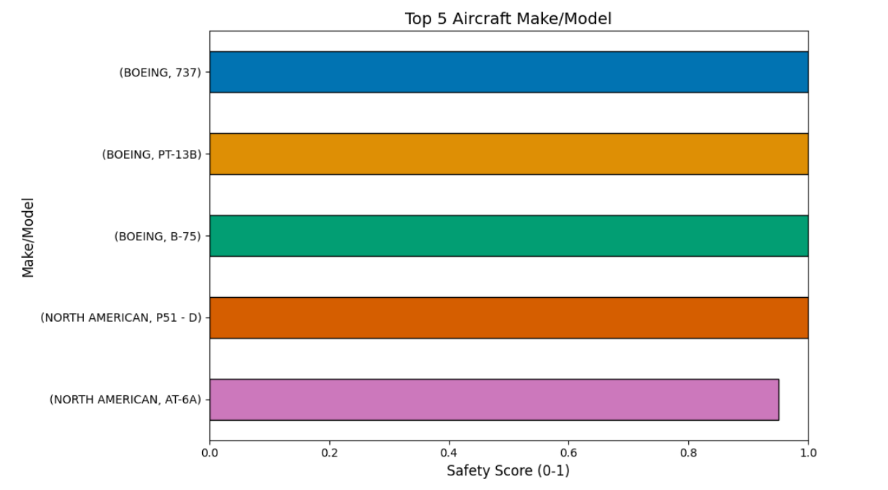
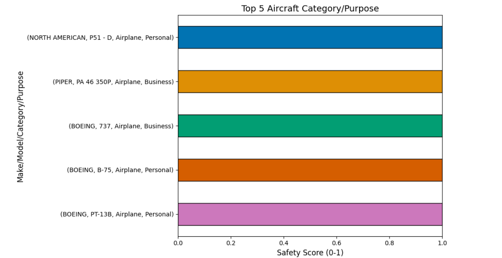
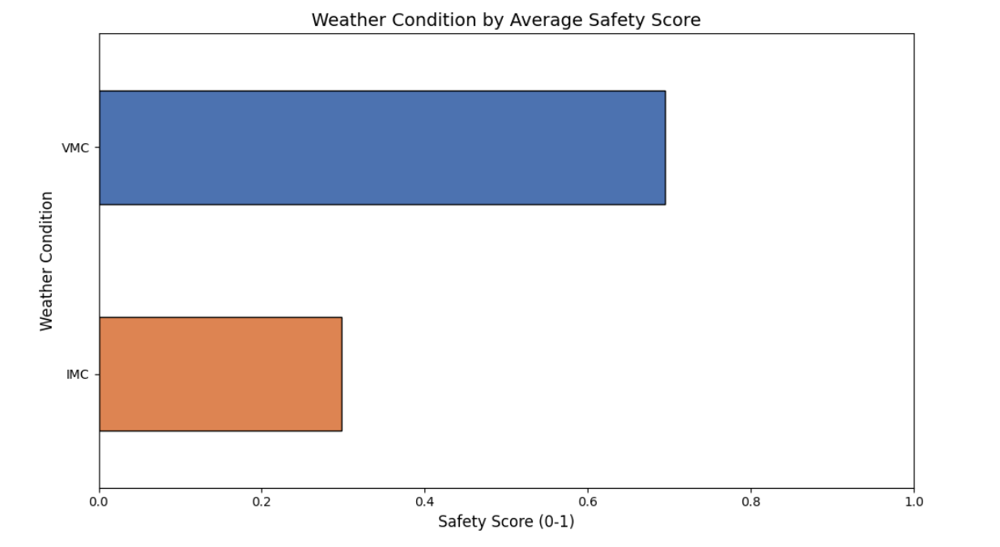

# Phase 1 Project Aircrafts Risks Analysis

## Project Overview

This project investigates aircraft accident data to determine the lowest-risk aircraft models for a company looking to expand into the aviation industry. The analysis aims to support data-driven decision-making when purchasing aircraft for commercial and private operations.

**Author**: [DAVID AMOS MNENE](mailto:david.mnene@student.moringaschool.com)

### Business Problem Statement

- My company is expanding in to new industries to diversify its portfolio. 
- Specifically, they are interested in purchasing and operating airplanes for commercial and private enterprises, but do not know anything about the potential risks of aircraft.
- I am charged with determining which aircraft are the lowest risk for the company to start this new business endeavor.
- I must then translate my findings into actionable insights that the head of the new aviation division can use to help decide which aircraft to purchase.

### Stakeholders
- **Executive Team**: Interested in understanding aviation risk for investment decisions.
- **New Aviation Division Head**: Requires actionable insights to guide aircraft purchases.

### Key Business Questions
1. What aircraft make and models have a low risk?
2. What aircraft category and flight purpose have a low risk?
3. What environmental or conditions are correlated with less risk?

### The Data

The dataset is from the National Transportation Safety Board that includes aviation accident data from 1962 to 2023 about civil aviation accidents and selected incidents in the United States and international waters.
I shall analyse and use the data to make actionable insights to aid in the aircraft purchase decision

### Description of Data
- Original dataset: 90,348 rows and 31 columns.
- Contains information on accident date, aircraft make/model, purpose of flight, injury severity, weather conditions, and more.

**RECOMMENDATION DECISION BASED COLUMNS:**
- MAKE
- MODEL

**FOCUS COLUMNS TO USE TO GET THE CLEANED DATAFRAME:**
- Purpose.of.flight
- Aircraft.Category

**COLUMN RISK ANALYSIS:**
- Injury.Severity
- Aircraft.damage
- Total.Fatal.Injuries
- Total.Serious.Injuries
- Total.Minor.Injuries
- Total.Uninjured
- Injury.Severity
- Weather.Condition
- Amateur.Built

### Visualizations

#### 1. Aircraft make survival rate
A bar chart showing the aircraft make categorized by the calculated survival rate.

#### 2. Top Five Aircraft Makes Model
A horizontal bar chart identifying make/model with the highest number of safety score.

#### 3. Top Five Aircraft Category/Purpose
A horizontal bar chart identifying category/purpose with the highest number of safety score.

#### 4. Weather Condition Impact
A horizontal bar graph of the safety score relation to the two weather conditions, VMC (Visual Meteorological Conditions) vs IMC (Instrument Meteorological Conditions).

#### INTERACTIVE EXECUTIVE DASHBOARD
[View Interactive Executive Dashboard](https://public.tableau.com/app/profile/david.amos/viz/AIRCRAFT_RISK_ANALYSIS/EXECUTIVESUMMARY?publish=yes)

## Conclusion

### Summary of Conclusions

1. **Low Risk Aircraft Makes**: Certain makes (e.g., Boeing and Aviat Aircraft Inc) have a higher safety score, hence lower risk.
2. **Top Aircraft Category/Purpose of flight**: Airplane categories and personal/business  purpose of flights has the highest safety score, hence lower risk.
3. **Weather Impact**: Most accidents occurred in VMC conditions, indicating pilot error or mechanical failure may be greater contributors than weather alone.

### Recommendation
- I recommend the top five aircraft makes, that is Boeing, Aviat Aircraft Inc, Maule, Stinson, Hughes, with a favor for Boeing mostly as it has the best safety rate as per the above analysis. The Boeing model that is recommended is Boeing 737, Boeing PT-138 and Boeing B-75.
- The best category is Airplane and Personal and Business Purpose flights.
- The analysis provides a data-driven foundation for making informed aircraft purchase decisions with lower risks.

